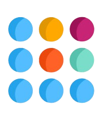

# LinkUp

<p align="center">
  
</p>

LinkUp is a cross-platform social and professional networking application built with Flutter that enables users to connect, share, and grow their professional networks.

## Table of Contents

- [Features](#features)
- [Technology Stack](#technology-stack)
- [Project Structure](#project-structure)
- [Getting Started](#getting-started)
  - [Prerequisites](#prerequisites)
  - [Installation](#installation)
  - [Configuration](#configuration)
- [Development](#development)
  - [Architecture](#architecture)
  - [State Management](#state-management)
  - [Coding Standards](#coding-standards)
  - [Testing](#testing)
- [Building and Deployment](#building-and-deployment)
- [Contributing](#contributing)
- [License](#license)
- [Contact](#contact)

## Features

### User Management

- User registration and authentication
- Profile creation and management
- Professional bio and skills showcase
- Resume upload and sharing
- Customizable privacy settings

### Networking

- Connect with other professionals
- Discover new connections
- Manage connection requests
- Track networking growth

### Content Sharing

- Create posts with text, images, and videos
- Share documents and presentations
- Like, comment, and share content
- Format posts with rich text editor

### Messaging

- Real-time one-on-one conversations
- Media sharing in chats
- Read receipts and typing indicators
- Message search and filtering

### Companies & Organizations

- Company profiles and pages
- Follow organizations of interest
- View company updates and posts
- Discover job opportunities

### Media Management

- Image optimization and compression
- Video playback and compression
- Document viewing and management
- Secure file storage and sharing

## Technology Stack

### Frontend

- **Flutter SDK** ^3.5.4: Core framework
- **Dart SDK** ^3.5.4: Programming language
- **Riverpod** ^2.6.1: State management
- **GoRouter** ^14.8.0: Navigation and routing
- **Flutter ScreenUtil** ^5.9.3: Responsive UI design

### UI Components

- **Flutter SVG** ^2.0.17: SVG rendering
- **Cached Network Image** ^3.3.1: Image caching
- **Skeletonizer** ^1.4.3: Loading states
- **Carousel Slider** ^5.0.0: Image carousels
- **Dotted Border** ^2.1.0: Custom borders
- **Syncfusion Flutter Charts** ^29.1.35: Data visualization

### Data & Storage

- **HTTP** ^1.3.0: API communication
- **Flutter Secure Storage** ^9.2.4: Secure data storage
- **Shared Preferences** ^2.5.2: Local storage
- **Path Provider** ^2.1.5: File system access

### Media Handling

- **Image Picker** ^1.1.2: Camera and gallery access
- **File Picker** ^9.2.2: Document selection
- **Video Player** ^2.9.3: Video playback
- **Chewie** ^1.7.0: Video player UI
- **Video Compress** ^3.1.2: Video optimization
- **Flutter Cached PDFView** ^0.4.3: PDF viewing

### Networking

- **Web Socket Channel** ^2.4.0: WebSocket communication
- **Socket.io Client** ^2.0.3+1: Real-time messaging
- **URL Launcher** ^6.3.1: External link handling
- **Any Link Preview** ^3.0.3: URL previews

### Others

- **Permission Handler** ^11.3.0: Device permissions
- **Timeago** ^3.3.0: Relative time formatting
- **Intl** ^0.18.1: Internationalization
- **Share Plus** ^10.1.4: Content sharing
- **Open FileX** ^4.3.2: File opening

## Project Structure

```
lib/
├── core/                  # Core app functionality
│   ├── config/            # App configuration
│   ├── constants/         # App constants
│   ├── services/          # Core services
│   ├── theme/             # App theme and styling
│   └── utils/             # Utility functions
├── features/              # App features by module
│   ├── auth/              # Authentication feature
│   ├── profile/           # User profile feature
│   ├── networking/        # Connections feature
│   ├── chat/              # Messaging feature
│   ├── feed/              # News feed feature
│   └── company/           # Company profiles feature
├── shared/                # Shared components
│   ├── models/            # Shared data models
│   ├── widgets/           # Reusable UI components
│   └── providers/         # Shared providers
├── routes/                # App routing
└── main.dart              # App entry point
```

## Getting Started

### Prerequisites

- Flutter SDK ^3.5.4
- Dart SDK ^3.5.4
- Android Studio / VS Code with Flutter plugins
- Android SDK / Xcode (for mobile development)

### Installation

1. Clone the repository

   ```bash
   git clone https://github.com/yourusername/link_up.git
   cd link_up
   ```

2. Install dependencies

   ```bash
   flutter pub get
   ```

3. Run the app
   ```bash
   flutter run
   ```

### Configuration

1. Environment Setup

   - Create `.env` files for different environments (development, staging, production)
   - Configure backend API endpoints

2. App Icons and Launch Screens

   - Generate app icons using Flutter Launcher Icons:
     ```bash
     flutter pub run flutter_launcher_icons
     ```

3. Permissions
   - Configure platform-specific permissions in:
     - `AndroidManifest.xml` for Android
     - `Info.plist` for iOS

## Development

### Architecture

LinkUp follows a feature-first architecture with the following layers:

1. **Presentation Layer**: Widgets and UI components
2. **Business Logic Layer**: Providers using Riverpod
3. **Data Layer**: Repositories and services
4. **Domain Layer**: Models and entities

### State Management

- **Providers**: For simple state
- **StateNotifiers**: For complex state
- **AsyncValue**: For handling async operations

Example usage:

```dart
// State definition
class ProfileNotifier extends StateNotifier<ProfileState> {
  ProfileNotifier(this._profileRepository) : super(ProfileState.initial());

  final ProfileRepository _profileRepository;

  Future<void> loadProfile(String userId) async {
    state = state.copyWith(isLoading: true);
    try {
      final profile = await _profileRepository.getProfile(userId);
      state = state.copyWith(profile: profile, isLoading: false);
    } catch (e) {
      state = state.copyWith(error: e.toString(), isLoading: false);
    }
  }
}

// Provider registration
final profileProvider = StateNotifierProvider<ProfileNotifier, ProfileState>((ref) {
  final repository = ref.watch(profileRepositoryProvider);
  return ProfileNotifier(repository);
});
```

### Coding Standards

- Follow the [Effective Dart](https://dart.dev/guides/language/effective-dart) style guide
- Use lint rules defined in analysis_options.yaml
- Write meaningful comments and documentation
- Follow feature-first folder structure

### Testing

- **Unit Tests**: Test individual components
- **Widget Tests**: Test UI components
- **Integration Tests**: Test feature workflows

Run tests with:

```bash
flutter test
```

## Building and Deployment

### Android

```bash
flutter build apk --release
# or
flutter build appbundle --release
```

### iOS

```bash
flutter build ios --release
# Then archive and upload using Xcode
```

## Contributing

1. Fork the repository
2. Create your feature branch (`git checkout -b feature/amazing-feature`)
3. Commit your changes (`git commit -m 'Add some amazing feature'`)
4. Push to the branch (`git push origin feature/amazing-feature`)
5. Open a Pull Request

## License

This project is proprietary and confidential.

## Contact

Project Lead - [cross-platform@linkup.com]

---
